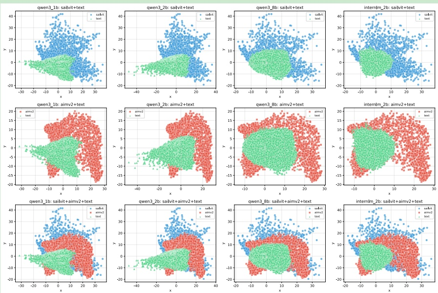

<table border=1 style='margin: auto; width: max-content;'><tr><td style='text-align: center;'>LLM</td><td style='text-align: center;'>ViT</td><td style='text-align: center;'>Average nearest neighbor distance</td><td style='text-align: center;'>Wasserstein distance</td><td style='text-align: center;'>Mean overall distance</td></tr><tr><td style='text-align: center;'>Qwen3-0.6B</td><td style='text-align: center;'>Aimv2</td><td style='text-align: center;'>1.42</td><td style='text-align: center;'>4.86</td><td style='text-align: center;'>10.78</td></tr><tr><td style='text-align: center;'>Qwen3-0.6B</td><td style='text-align: center;'>SAIL-ViT</td><td style='text-align: center;'>1.15</td><td style='text-align: center;'>3.88</td><td style='text-align: center;'>9.52</td></tr><tr><td style='text-align: center;'>Qwen3-1.7B</td><td style='text-align: center;'>Aimv2</td><td style='text-align: center;'>1.30</td><td style='text-align: center;'>4.65</td><td style='text-align: center;'>11.11</td></tr><tr><td style='text-align: center;'>Qwen3-1.7B</td><td style='text-align: center;'>SAIL-ViT</td><td style='text-align: center;'>1.05</td><td style='text-align: center;'>3.60</td><td style='text-align: center;'>9.89</td></tr><tr><td style='text-align: center;'>Qwen3-8B</td><td style='text-align: center;'>Aimv2</td><td style='text-align: center;'>0.78</td><td style='text-align: center;'>3.59</td><td style='text-align: center;'>11.24</td></tr><tr><td style='text-align: center;'>Qwen3-8B</td><td style='text-align: center;'>SAIL-ViT</td><td style='text-align: center;'>0.66</td><td style='text-align: center;'>2.63</td><td style='text-align: center;'>10.06</td></tr><tr><td style='text-align: center;'>Interlm2.5-1.8B</td><td style='text-align: center;'>Aimv2</td><td style='text-align: center;'>1.17</td><td style='text-align: center;'>4.14</td><td style='text-align: center;'>10.99</td></tr><tr><td style='text-align: center;'>Interlm2.5-1.8B</td><td style='text-align: center;'>SAIL-ViT</td><td style='text-align: center;'>0.96</td><td style='text-align: center;'>3.18</td><td style='text-align: center;'>9.79</td></tr></table>

Table 7: Comparison of LLM and ViT models on three distance metrics.

Figure 6: Visualization of token embedding distributions across different models and combination strategies. Each row corresponds to a model variant (Qwen3-0.6B, Qwen3-1.7B, Qwen3-8B, InternLM-1.8B), and each column illustrates a grouping strategy: combining SAIL-ViT with text embeddings, AIMv2 with text embeddings, or all three jointly. Colors and markers indicate 'SAIL-ViT', 'AIMv2', and 'text' tokens, highlighting spatial relationships and overlaps between embedding spaces.

Specifically, we calculate the distribution distance between visual features extracted by SAIL-ViT (and its baseline) and textual features from LLMs of different sizes and types. We randomly sampled five images from the internet, extracted their visual features using both SAIL-ViT and its baseline, and concatenated them to form a feature collection of size  $ [5120, 1024] $ . Then, we applied Principal Component Analysis (PCA) to reduce the dimensionality to  $ [5120, 2] $ . On the textual side, we extracted feature vectors from the lookup tables of different LLMs. We quantified the distribution distances by computing the average nearest neighbor distance, Wasserstein distance, and mean overall distance between these feature clusters. As shown in Figure 6, the visualization results show that the visual feature vectors extracted by SAIL-ViT are more compact and exhibit greater overlap with textual feature vectors, whereas the baseline model produces more dispersed visual features with less overlap with the textual space. Quantitatively, as shown in the table below, the visual feature space of SAIL-ViT is significantly closer to the textual feature space of LLMs across different sizes and architectures, as measured by multiple distance metrics. These results demonstrate that SAIL-ViT effectively reduces the gap between visual and textual feature spaces.