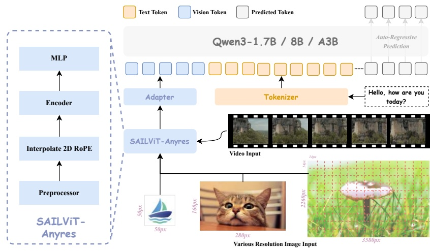

Figure 2: Overview of the SAIL-VL2 framework. The architecture is composed of a vision encoder (SAIL-ViT) that aligns visual inputs into the representation space of the LLM. A lightweight adapter further transforms visual embeddings into tokenized representations, which are jointly processed with linguistic embeddings for multimodal reasoning and prediction. SAIL-VL2 accommodates multiple LLM backbones, ensuring flexibility and scalability across model configurations.

## 2 Model Architecture

As shown in Table 1 and Figure 2, we initialize the LLM with the Qwen3 series models and the ViT with the SAIL-ViT series models. In this section, we introduce the architecture of SAIL-VL2, which follows the general framework of LVMs and is composed of three core components:

<table border=1 style='margin: auto; width: max-content;'><tr><td style='text-align: center;'>Model</td><td style='text-align: center;'>Vision Encoder</td><td style='text-align: center;'>Language Model</td><td colspan="3">#Param</td></tr><tr><td style='text-align: center;'></td><td style='text-align: center;'></td><td style='text-align: center;'></td><td style='text-align: center;'>Vision</td><td style='text-align: center;'>Language</td><td style='text-align: center;'>Total</td></tr><tr><td colspan="6">Dense Models</td></tr><tr><td style='text-align: center;'>SAIL-VL2-2B</td><td style='text-align: center;'>SAIL-ViT-Huge</td><td style='text-align: center;'>Qwen3-1.7B</td><td style='text-align: center;'>0.6B</td><td style='text-align: center;'>2.0B</td><td style='text-align: center;'>2.6B</td></tr><tr><td style='text-align: center;'>SAIL-VL2-8B</td><td style='text-align: center;'>SAIL-ViT-Huge</td><td style='text-align: center;'>Qwen3-8B</td><td style='text-align: center;'>0.6B</td><td style='text-align: center;'>8.2B</td><td style='text-align: center;'>8.8B</td></tr><tr><td colspan="6">MoE Models</td></tr><tr><td style='text-align: center;'>SAIL-VL2-30B-A3B</td><td style='text-align: center;'>SAIL-ViT-Huge</td><td style='text-align: center;'>Qwen3-30B-A3B</td><td style='text-align: center;'>0.6B</td><td style='text-align: center;'>30.5B</td><td style='text-align: center;'>31.1B (A3B)</td></tr></table>

Table 1: Configurations of different scales and variants in our SAIL-VL2 series.

Vision Encoder: The vision encoder of SAIL-VL2 builds on the Vision Transformer (ViT) architecture, which encodes images and videos into sequences of visual tokens for multimodal reasoning within the LLM. The core challenge lies in the modality and semantic gap, as visual and linguistic tokens originate from heterogeneous spaces and must be aligned into a unified representation. To address this, we introduce SAIL-ViT (Yin et al., 2025), a tailored vision encoder that evolves from ViT through a progressive training pipeline, enabling step-by-step alignment of visual features with the LLM's representation space. The system encompasses a family of visual encoders, including a standard image encoder, and an any-resolution encoder, thereby accommodating diverse multimodal requirements. This progressive design enhances visual–linguistic alignment in a stepwise manner and ultimately achieves comprehensive cross-modal integration.