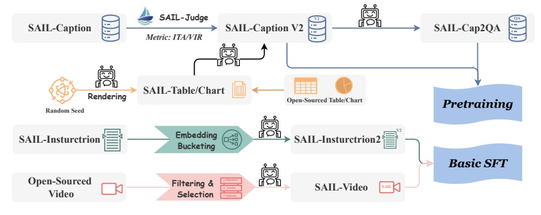

Figure 3: Data construction pipeline for SAIL-VL2 training. High-quality multimodal corpora are constructed by curating and filtering open-source datasets, and generating synthetic data, with both components systematically organized to meet the requirements of different training stages.

### 2.2 Multi-modal Mixture-of-Experts

Mixture-of-Experts (MoE) (Team et al., 2025; Li et al., 2024b; Shu et al., 2024; Li et al., 2025; Hong et al., 2025; Huang et al., 2024) provides an effective strategy for scaling LLMs by replacing standard MLP layers with parallel expert modules. A gating function activates only a small subset of experts for each token, enabling parameter scaling while preserving computational efficiency through sparse activation. In SAIL-VL2, we adopt Qwen3-based MoE structures and introduce strategies to ensure both stability and scalability. Balanced expert activation is critical for consistent scaling. Following prior work, we employ an auxiliary load-balancing loss and average activation across ranks to improve stability. Beyond loss design, we observe that activation patterns vary with data distribution, underscoring the importance of distribution-aware tuning. To preserve expert specialization learned during pre-training, we conduct data probing and automatic calibration on language data, which maximizes expert activation entropy. This maintains activation behavior on text-only calibration sets and significantly improves entropy on multimodal sets.

SAIL-VL2 is ultimately composed of a well-trained SAIL-ViT, an adapter, and an LLM. In the following, we present the comprehensive training strategy that empowers this architecture to achieve effective multimodal alignment and strong vision-language reasoning capabilities.

## 3 Pre-Training

In this section, we detail the pre-training process of SAIL-VL2, including the curation and organization of pre-training data as well as the training recipe.

### 3.1 Pre-Training Data

Building on the pre-training data of SAIL-VL (Dong et al., 2025a), SAIL-VL2 further upgrades and expands SAIL-Caption into SAIL-Caption2, providing more accurate annotations and a broader data distribution. Beyond basic caption data, we also construct a generic QA corpus through a Caption2QA procedure. Specifically, a subset of captions from SAIL-Caption2 is transformed into QA pairs using a powerful LVM guided by carefully designed prompts. This process enriches the distributional diversity of QA data and enhances the model's generalization capability. In addition, following the data composition strategy of SAIL-VL, we incorporate pure text data (Gu et al., 2024; Teknium, 2023; Toshniwal et al., 2024) to preserve the LLM's fundamental language modeling and comprehension ability during multimodal pre-training. We also collect large-scale multimodal instruction-tuning VQA datasets (Xu et al., 2024a; Wang et al., 2024a; Laurençon et al., 2024b; Tong et al., 2024; Gu et al., 2024; Li et al., 2024a), which further enhance the model's multimodal understanding and instruction-following capacity.