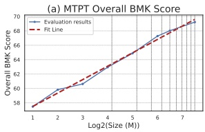
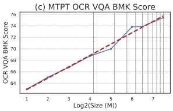

Figure 4: Scaling curves of SAIL-VL2-2B during the multi-task pre-training stage. Results are reported on overall benchmarks, natural-scene VQA datasets, and OCR VQA tasks. 'BMK Score' denotes the average benchmark score.

## 4 Post-Training

We further enhance SAIL-VL2's instruction-following ability and incentivize its reasoning capability through a comprehensive post-training stage. The post-training process is structured as a holistic pipeline. It begins with an instruction-tuning SFT stage, aimed at injecting general knowledge and improving fundamental instruction adherence. This is followed by a two-phase thinking-fusion training pipeline that progressively combines SFT with reinforcement learning (SFT-RL) to strengthen the SAIL-VL2's reasoning ability.

### 4.1 Post-Training Data

In the post-training stage, we organize the data into several categories according to their types and functional roles, and describe the curation process of each in detail.

#### 4.1.1 SAIL-Video

We initially curate 6.23M video-QA samples from ShareGPTVideo-QA (Zhang et al., 2024a), NextQA (Xiao et al., 2021), LongVideoBench-val (Wu et al., 2024b), PerceptionTest-val (Patraucean et al., 2023), LLaVA-Video-QA (Zhang et al., 2024b), and VideoGPT (Yan et al., 2021). After applying systematic scoring and filtering criteria, we obtain a refined corpus of 5.1M high-quality samples for our SAIL-Video.

For video data filtering and selection, we evaluate quality from two complementary perspectives.

• Frame–Instruction Alignment. Most video LVMs (Cheng et al., 2024; Shu et al., 2023; Wang et al., 2024b; Lin et al., 2023a; Xu et al., 2024b) perform tasks such as QA on sampled frames, whereas most existing datasets provide annotations based on continuous video streams. This discrepancy can result in misalignment between sampled frames and instructions, potentially leading to spurious learning or hallucinations.

- Data Quality and Task Difficulty. We further assess the overall richness of visual content—capturing element diversity, scene complexity, and information density, as well as the difficulty of associated QA tasks, including reasoning depth, requirements for spatial–temporal understanding, multi-instance interactions, and reliance on external knowledge.

To operationalize these criteria, we design specific scoring rules and prompts, defining three metrics: video–QA alignment (−1-10), video content richness (−1-7), and QA difficulty (−1-8). Here, a score of −1 indicates that LVM API refused to respond, while higher values represent better quality or greater difficulty. Each video is evaluated under these metrics using the powerful LVM API. For the final selection, we retain videos with alignment and content scores of at least 5 and a difficulty score of at least 3. This procedure yields the final pre-training video corpus.

#### 4.1.2 SAIL-Instruction2

Building on the instruction-tuning dataset used in SAIL-VL, SAIL-Instruction, we refine and expand both scale and quality to construct a larger and higher-quality corpus, SAIL-Instruction2. Beyond the datasets employed in SAIL-Instruction (e.g., LLaVA-OneVision(Li et al., 2024a) and Cauldron(Laurençon et al., 2024b)), we incorporate additional high-quality open-source instruction-tuning datasets, including Mammoth(Guo et al., 2024), MMPR(Wang et al., 2024a), and Molmo (Deitke et al., 2024), thereby providing broader coverage and stronger supervision for instruction-following pre-training. To enhance