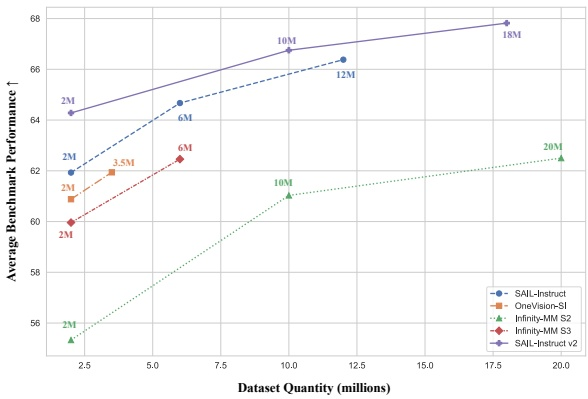

effectiveness, we sample long-answer and reasoning-oriented instances from the LLaVA-CoT, MMPR, and Condor datasets, fostering more complex reasoning behaviors. Following SAIL-VL (Dong et al., 2025a), all incremental data undergo a two-stage validation process: (i) a quality evaluation to ensure intrinsic reliability, and (ii) an incremental evaluation to verify performance gains when integrated with existing data. Only data passing both stages is retained.

To enhance diversity and mitigate distributional bias, we employ a latent-class-based filtering strategy. For each VQA sample, an LVM generates a descriptive phrase, from which logits and latent embeddings are extracted to define its latent class. This approach maps heterogeneous samples into a unified semantic space, effectively bridging the representation gap across datasets. We enhance the original coarse-level dataset classification by clustering latent classes into fine-grained semantic buckets, thereby expanding the category space by nearly tenfold. Using these refined classification buckets, we perform uniform sampling and re-annotate the samples with APIs from state-of-the-art closed-source models, improving both dataset accuracy and consistency. This strategy not only balances the sample distribution but also enhances overall data quality. Finally, 20M high-quality, diverse samples form our SAIL-Instruction2 dataset.

Instruction Data Analysis. To investigate the effect of instruction data on model performance, we conduct a systematic comparison using SAIL-VL2-2B as the base architecture after multi-task pre-training. As illustrated in Figure 5, we evaluate SFT results across different datasets and data scales. Compared with prior instruction datasets, our SAIL-Instruction2 consistently delivers superior performance under the same data budget. This demonstrates that SAIL-Instruction2 provides higher-quality supervision and validates the effectiveness of our data optimization and filtering pipeline. These findings underscore the critical role of curated and diversified instruction data in enhancing multimodal instruction-following capabilities.

Figure 5: Analysis of instruction data quality and scale on model performance. Using SAIL-VL2-2B as the base architecture after multi-task pre-training, we compare SFT results across different datasets and data scales.

#### 4.1.3 Multimodal CoT Data

To cultivate strong multimodal reasoning capabilities, we construct a large-scale dataset by aggregating diverse public sources and organizing them into two complementary subsets for the LongCoT SFT, Think-Fusion SFT and the subsequent Reinforcement Learning. The SFT corpus integrates established visual-instruction and mathematical reasoning datasets, including VisualWebInstruct (Jia et al., 2025), MathV360K (Shi et al., 2024a), and LLaVA-CoT (Xu et al., 2024a), providing the model with structured reasoning supervision. For the RL stage, we expand the scope to cover a broader range of tasks—Math (Sun et al., 2024; Meng et al., 2025; Xiao et al., 2025; Zhang et al., 2025), Puzzle (Chia et al., 2024), Science (Wang et al., 2025b; Lu et al., 2022), OCR (Chen et al., 2025), and Counting (Johnson et al., 2017)—to enhance generalization and robustness. Since these heterogeneous sources inevitably contain noise and formatting inconsistencies, we employ a rigorous data curation pipeline, described in the following section. After refinement, the final dataset comprises 400K samples for LongCoT SFT, 1M samples for Think-Fusion SFT, 50K samples for RL with verifiable rewards, and 100K samples for RL with a mixed reward system.